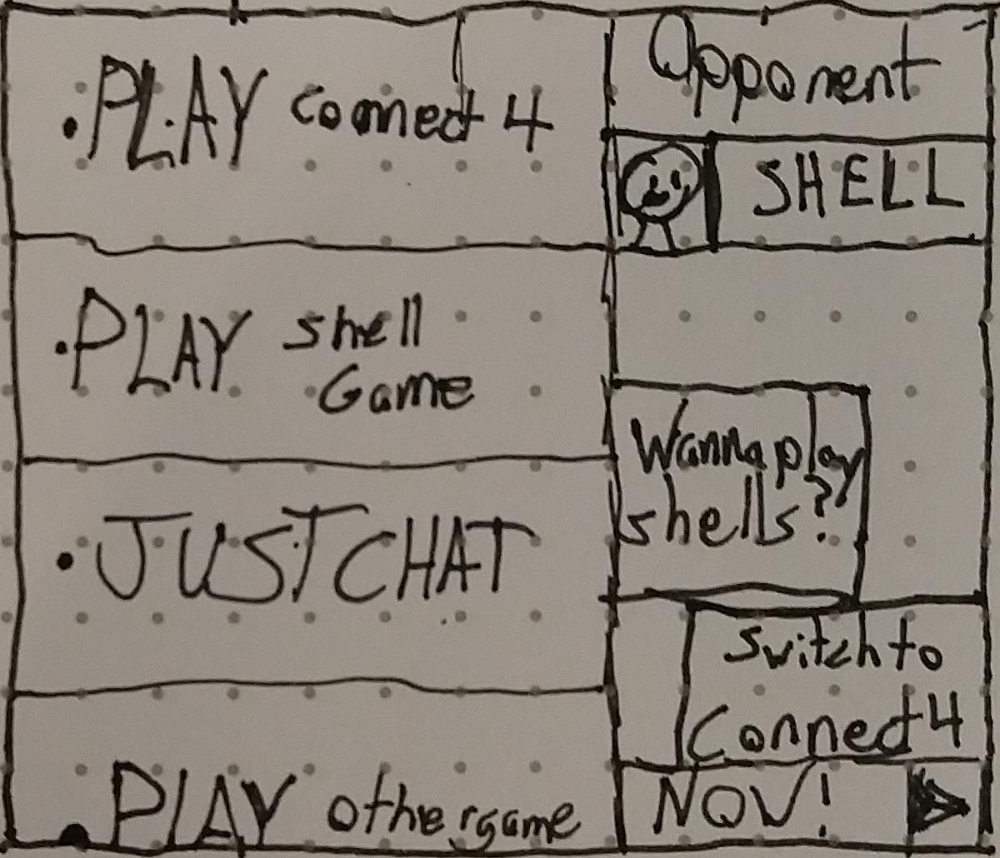
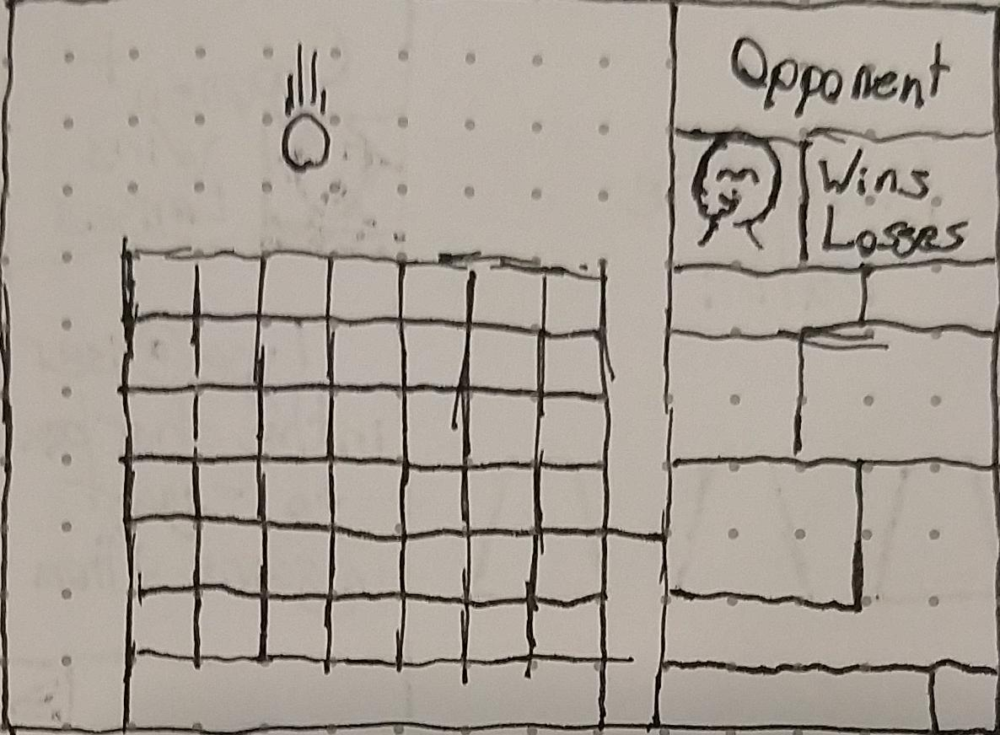
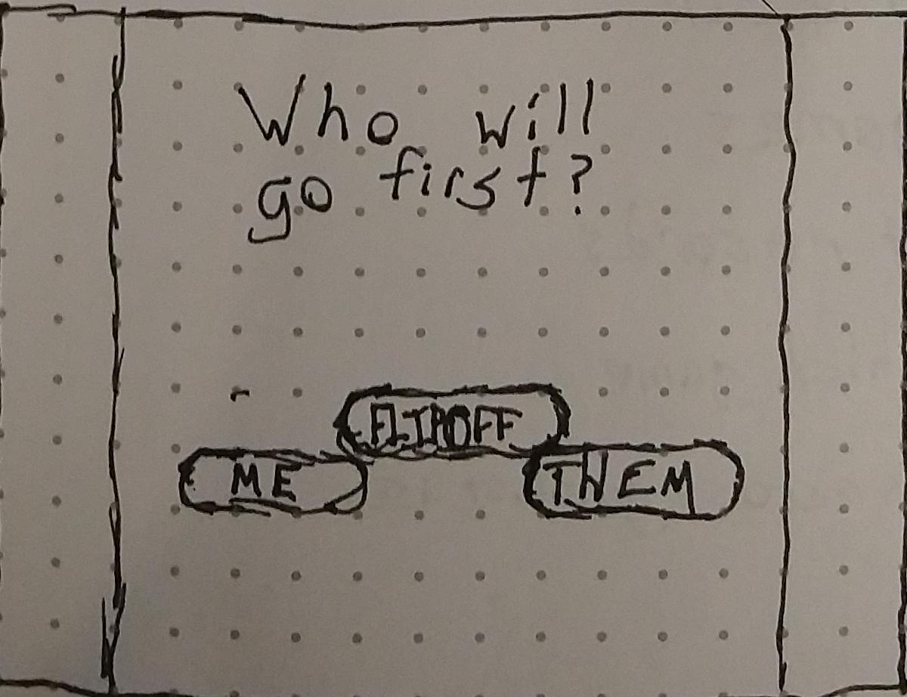
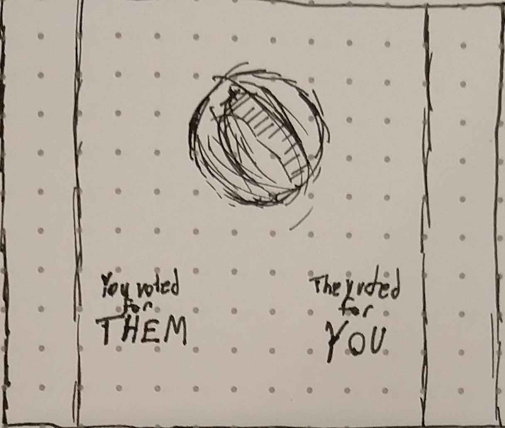
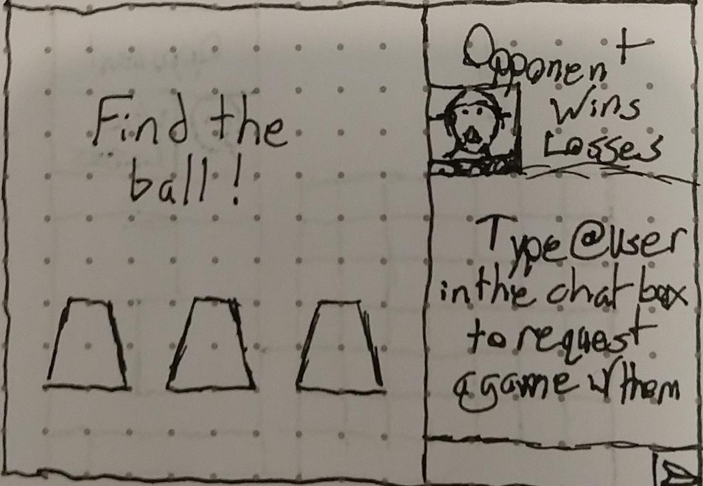
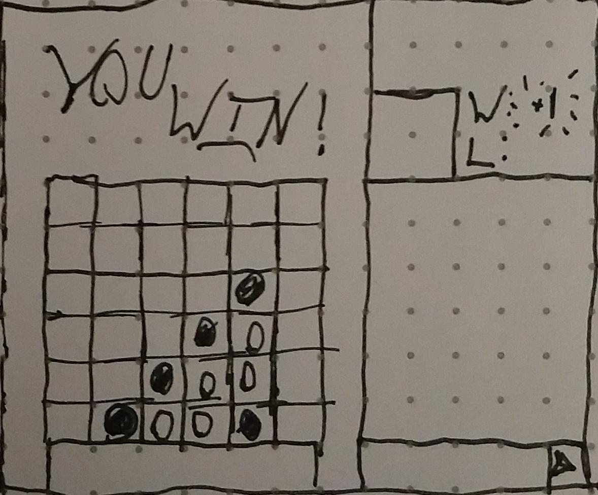

# Connect More
#### _A place to connect and play with friends_

 Connect| Chat | Play
 :-:|:-:|:-:
 |  | 
 |  | 
 ||

**Who am I?** I'm Mark!

**Why did I make this?** I like these games and I thought making my own versions would be illuminating.

### User Stories
* User can name themself and see that reflected in-app
* User can select from a number of avatars
* User can select an activity to engage in
* User can vote for whom they wish to go first, if a game is selected
* Users can watch a coin flip if they do not agree on who should go first
* User can play Connect 4 locally against a friend
* User can select a row to drop their piece into, and see it fall
* User receives a win when they line up 4 pieces horizontally, vertically or diagonally
* User can play Shell Game, either hiding or finding
* User receives a win if they find the hidden ball, or if they hide the ball successfully
* User takes turns with opponent
* User can see a record of wins and losses
* User can forfeit a game
### Future Stories
* User can connect over network to game
* Users can opt to simply chat
* User can request a session with a different partner
* User can see wins and losses across games and opponents
* User can play other games (TBD)
